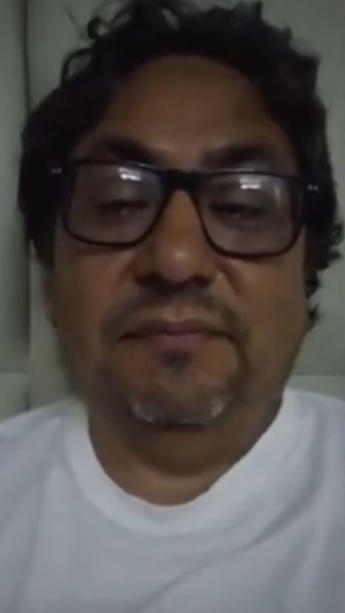
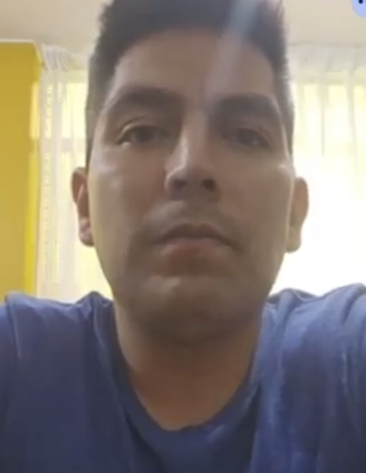
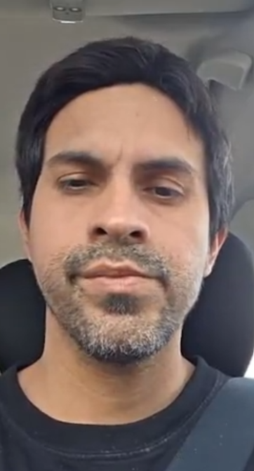
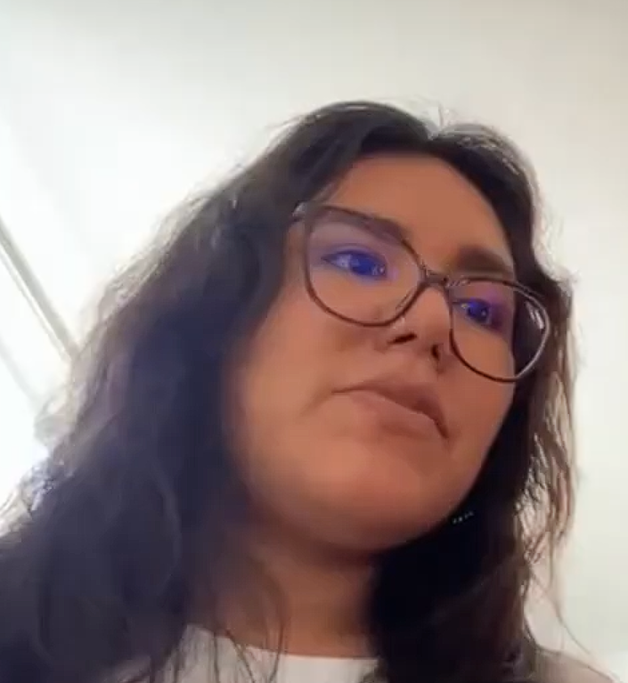
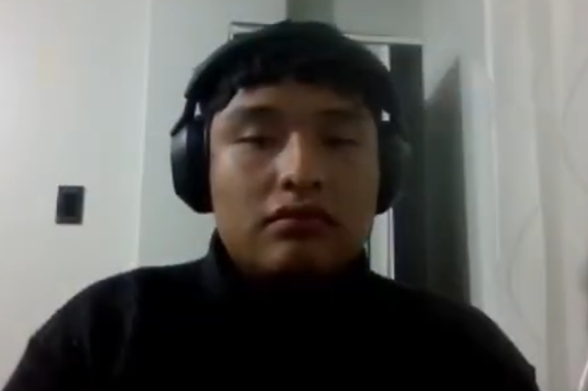
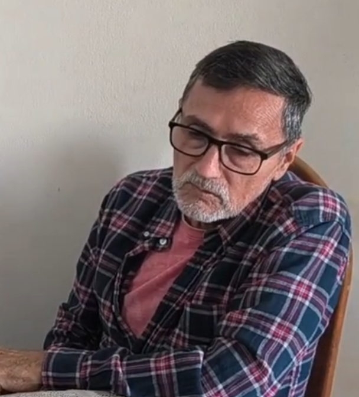
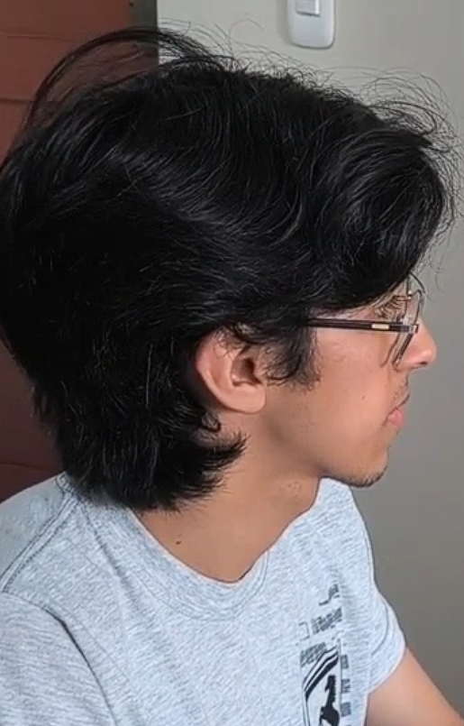
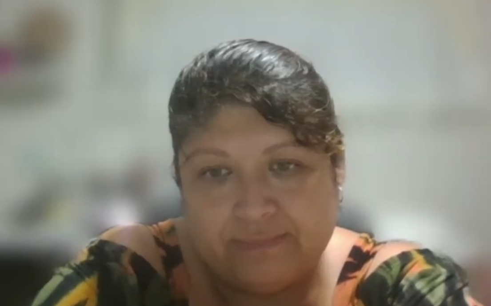

# Capítulo II: Requirements Elicitation & Analysis

## 2.1. Competidores

### 2.1.1. Análisis competitivo

### 2.1.2. Estrategias y tácticas frente a competidores

## 2.2. Entrevistas

### 2.2.1. Diseño de entrevistas

### 2.2.2. Registro de entrevistas

Link:

**Primer Segmento Objetivo (Administradores de establecimientos de PNAS)**

**Entrevista 1**

| Entrevistado: | Entrevistador: Alejandra Astocondor |
| ------------- | -------------- |
|  |  |
| Duración: |  |
| Nombre completo: |  |
| Edad: |  |
| Distrito: |  |
| Resumen: |  |

**Entrevista 2**

| Entrevistado: | Entrevistador: Alejandra Astocondor |
| ------------- | -------------- |
|  |  |
| Duración: |  |
| Nombre completo: |  |
| Edad: |  |
| Distrito: |  |
| Resumen: |  |

**Entrevista 3**

| Entrevistado: | Entrevistador: Alejandra Astocondor |
| ------------- | -------------- |
|  |  |
| Duración: |  |
| Nombre completo: |  |
| Edad: |  |
| Distrito: |  |
| Resumen: |  |

**Segundo Segmento Objetivo (Doctores de establecimientos de PNAS)**

**Entrevista 1**

| Entrevistado: Carmen Gabriela | Entrevistador: Alejandra Astocondor |
| -------------- | -------------- |
|  |  |
| Duración: | 0:00 - 4:56 (4:56 minutos) |
| Nombre completo: | Carmen Patricia Gabriela Perez |
| Edad: | 62 años |
| Distrito: | Lima |
| Resumen: | Menciona que una consulta médica promedio tiene una duración de 12 minutos, que inicia con la toma de datos y antecedentes para luego centrarse en el motivo de la visita. Actualmente, utiliza el sistema ESI para el registro de información. En cuanto a dificultades, se ve afectada por falta de tiempo, la inestabilidad del internet y la pérdida de historias clínicas durante las horas pico. Tambien cuenta que ella no ha tenido problemas con errores o duplicación de información, pero que tiene compañeros que si lo han experimentado. Por la parte de gestión, ella se encarga de las recetas, las citas solo les indica los horarios a los digitadores y ellos se encargan. Esta dispuesta a usar herramientas digitales, por la facilidad para consultar el historial y exámenes previos. De igual manera, identifica la necesidad de optimizar el tiempo mediante un sistema inteligente capaz de generar resúmenes de la historia del paciente y la implementación de grabación de consulta por voz para agilizar el registro de datos. |

**Entrevista 2**

| Entrevistado: Jorge Mendoza | Entrevistador: Alejandra Astocondor |
| ------------- | -------------- |
|  |  |
| Duración: | 4:57 - 9:46 (4:49 minutos) |
| Nombre completo: | Jorge Mendoza Toribio |
| Edad: | 35 años |
| Distrito: | Lima |
| Resumen: |  |

**Entrevista 3**

| Entrevistado: Jose Mejia | Entrevistador: Alejandra Astocondor |
| ------------- | -------------- |
|  |  |
| Duración: | 9:47 - 13:22 (3:35 minutos)  |
| Nombre completo: | Jose Miguel Mejia Azareño |
| Edad: | 40 años |
| Distrito: | Lima |
| Resumen: |  |

**Tercer Segmento Objetivo (Pacientes de todas las edades)**

**Entrevista 1**

| Entrevistado: | Entrevistador: Nestor Rojas |
| ------------- | -------------- |
|  |  |
| Duración: |  |
| Nombre completo: |  |
| Edad: |  |
| Distrito: |  |
| Resumen: |  |

**Entrevista 2**

| Entrevistado: | Entrevistador: Kamil Diaz |
| ------------- | -------------- |
|  |  |
| Duración: |  |
| Nombre completo: |  |
| Edad: |  |
| Distrito: |  |
| Resumen: |  |

**Entrevista 3**

| Entrevistado: | Entrevistador: Adrian Ruiz |
| ------------- | -------------- |
|  |  |
| Duración: |  |
| Nombre completo: |  |
| Edad: |  |
| Distrito: |  |
| Resumen: |  |

**Entrevista 4**

| Entrevistado: | Entrevistador: Leo Dulanto |
| ------------- | -------------- |
|  |  |
| Duración: |  |
| Nombre completo: |  |
| Edad: |  |
| Distrito: |  |
| Resumen: |  |